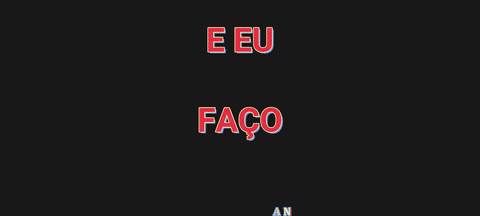
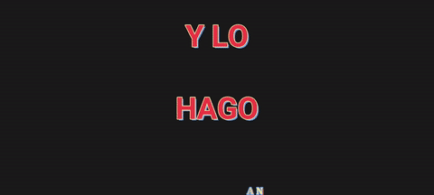
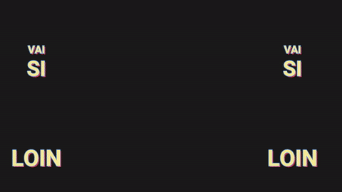
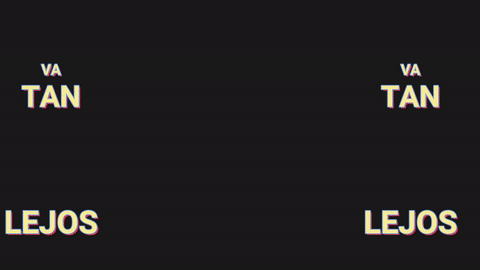
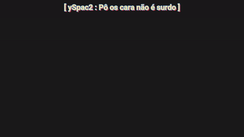
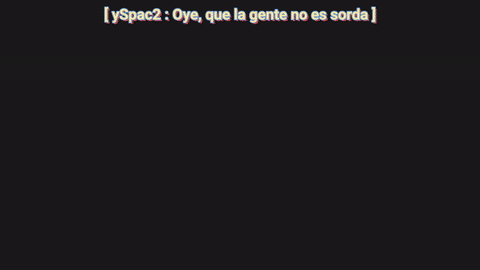
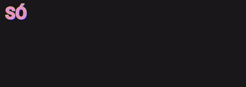

# 🌌 Unlimited Tradu Web
**Break the language barrier. Preserve the art.**

*A Chrome extension that translates heavily styled YouTube subtitles (SRV3 / YTT) into any language, keeping their karaoke, typewriters, vertical text, glitches, colors and positions.*

 

[🇺🇸 **English**](#-english) &nbsp; | &nbsp; [🇪🇸 **Español**](#-español)

 

<a href="https://github.com/SonizBeibe/Unlimited-Tradu/releases/latest"><b>⬇️ Download v2.0</b></a> &nbsp;·&nbsp; <a href="https://ko-fi.com/sonizzidk"><b>💎 Unlock Local Mode</b></a>

## 🎬 See it in action · Míralo en acción

Real fan-made YouTube subtitles, **Portuguese ➜ Spanish**, translated with **Local Mode (Fidelity)**. Every effect stays in place; only the words change.
*Subtítulos reales de YouTube hechos por fans, **portugués ➜ español**, traducidos con el **Modo Local (Fidelidad)**. Cada efecto queda en su lugar; solo cambian las palabras.*

| Effect · Efecto | Original 🇧🇷 | Translation · Traducción 🇪🇸 |
|:--|:--:|:--:|
| **Karaoke with boxes** Highlight boxes and per-syllable timing, kept word by word. *Cajas de resaltado y tiempos por sílaba, palabra por palabra.* |  |  |
| **Vertical syllables** Words split in stacked syllables, re-split in the new language. The French stays in French. *Palabras en sílabas apiladas, re-silabeadas en el idioma nuevo. El francés queda en francés.* |  |  |
| **Vertical text + karaoke** Letter-by-letter columns, decorations and chat-style lines, all in sync. *Columnas letra por letra, adornos y líneas tipo chat, todo sincronizado.* |  |  |
| **Typewriter + word colors** The sentence types itself in, and each word keeps its own color. *La frase se escribe sola y cada palabra conserva su color.* |  |  |
| **Word-by-word karaoke** Staggered words with their own boxes and sizes. *Palabras escalonadas con sus propias cajas y tamaños.* |  |  |
| **Only the source language** Portuguese is translated; the Japanese and French lines are left as the artist wrote them. *Se traduce el portugués; las líneas en japonés y francés quedan como las escribió el artista.* |  |  |

Previews rendered from the real <code>.ass</code> files over a plain background. Original subtitles belong to their respective authors. *Vistas previas renderizadas desde los <code>.ass</code> reales sobre un fondo liso. Los subtítulos originales pertenecen a sus autores.*

---

<h2 id="-english">🇺🇸 English</h2>

> **The problem:** YouTube's auto-translate destroys styled subtitles. Fonts, colors, karaoke and positions are reduced to plain text at the bottom of the video.
>
> **The solution:** Unlimited Tradu Web takes the original styled subtitles, translates them with context-aware AI and draws them back over the video with every effect intact.

### ⚖️ Two engines

| | 🌐 **Gemini** · Free | 💎 **Local** · Premium |
|:--|:--:|:--:|
| API Key | Your own (free from Google) | **Not needed** |
| Modes | Base · Reading | **Fidelity** · Base · Reading |
| Effects rebuilt piece by piece (syllable karaoke, vertical text, typewriter) | — | ✅ |
| Whole lyrics translated with context (consistent choruses) | — | ✅ |
| 🎵 Song / 🎬 Video types | — | ✅ |
| Watch while it translates | — | ✅ |
| Only the source language is translated | ✅ | ✅ |

#### 💎 How to unlock Local Mode
1. In the panel, choose **🖥️ Local**. Your ID appears below: `🔑 Tu ID: XXXX-XXXX` (click to copy it).
2. Join the membership at **[ko-fi.com/sonizzidk](https://ko-fi.com/sonizzidk)**.
3. Open the **[activation page](https://utraduu.dennisaxel17.workers.dev/activar)**, enter the email you paid with on Ko-fi and your ID. Done: renewals are credited automatically.

> Your ID belongs to your browser. If you reinstall the extension or move to another PC, you get a new ID: message me on Ko-fi so I can move your membership to it.

### ✨ Features
* 🎭 **Faithful rendering:** a custom ASS/SRV3 engine with animations (`\t`), positioning (`\pos`, `\move`), fades (`\fad`), karaoke, glows and borders.
* 🎯 **Three translation modes:** *Fidelity* (effects rebuilt piece by piece, Local), *Base* (the classic effect system) and *Reading* (one clean line, no effects).
* ▶️ **Watch while it translates (Local):** the first part, up to the chorus, plays as soon as it's ready.
* 🎨 **View styles:** `All FX`, `No boxes`, `Clean text`, `Classic SRT`, `SRT colors` and **`Translation`** (original on top, translation below, great for learning).
* 🎛️ **On-the-fly controls:** scale, margins, boxes, chromas, shadows and fades.
* ⚡ **Instant cache:** videos that were already translated load right away.

### ⚙️ Installation (Developer Mode)
1. Download the latest `.rar` from [Releases](https://github.com/SonizBeibe/Unlimited-Tradu/releases/latest) and extract it.
2. Open `chrome://extensions/` and turn on **Developer mode** (top right).
3. Click **Load unpacked** and select the extracted folder.
4. Open a YouTube video with styled subtitles, open the S&S panel in the player, pick your engine and hit **Translate**.

**Updating:** extract the new version over the old folder and click **↻ Reload** in `chrome://extensions`.

### ⚖️ License & Fair Use
**All Rights Reserved.** The source code is published strictly for **transparency and security auditing**. You're welcome to inspect it to make sure your data is safe.

**Copying, modifying, distributing or publishing derivative versions is strictly prohibited** without explicit written permission from the author.

**Why?** AI translation runs on servers. The official version and the Local Mode membership pay for those servers and keep the free engine available to everyone. Clones hurt the project's sustainability. Thank you for supporting the official release!

---

<h2 id="-español">🇪🇸 Español</h2>

> **El problema:** la traducción automática de YouTube destruye los subtítulos con estilo. Fuentes, colores, karaoke y posiciones quedan reducidos a texto plano abajo del video.
>
> **La solución:** Unlimited Tradu Web toma los subtítulos originales con estilo, los traduce con IA que entiende el contexto y los vuelve a dibujar sobre el video con todos sus efectos.

### ⚖️ Dos motores

| | 🌐 **Gemini** · Gratis | 💎 **Local** · Premium |
|:--|:--:|:--:|
| API Key | La tuya (gratis de Google) | **No hace falta** |
| Modos | Base · Lectura | **Fidelidad** · Base · Lectura |
| Efectos rearmados pieza por pieza (karaoke por sílaba, texto vertical, typewriter) | — | ✅ |
| Letra entera traducida con contexto (estribillos coherentes) | — | ✅ |
| Tipo 🎵 Canción / 🎬 Video | — | ✅ |
| Ves el video mientras se traduce | — | ✅ |
| Solo se traduce el idioma de origen | ✅ | ✅ |

#### 💎 Cómo activar el Modo Local
1. En el panel, elige **🖥️ Local**. Abajo aparece tu ID: `🔑 Tu ID: XXXX-XXXX` (clic para copiarlo).
2. Hazte miembro en **[ko-fi.com/sonizzidk](https://ko-fi.com/sonizzidk)**.
3. Entra a la **[página de activación](https://utraduu.dennisaxel17.workers.dev/activar)**, pon el email con el que pagaste en Ko-fi y tu ID. Listo: las renovaciones se acreditan solas.

> Tu ID es de tu navegador. Si reinstalas la extensión o cambias de PC, sale un ID nuevo: escríbeme por Ko-fi y te paso la membresía.

### ✨ Características
* 🎭 **Renderizado fiel:** motor ASS/SRV3 propio con animaciones (`\t`), posiciones (`\pos`, `\move`), fades (`\fad`), karaoke, resplandores y bordes.
* 🎯 **Tres modos de traducción:** *Fidelidad* (efectos rearmados pieza por pieza, Local), *Base* (el sistema de efectos clásico) y *Lectura* (una línea limpia, sin efectos).
* ▶️ **Mira mientras se traduce (Local):** la primera parte, hasta el estribillo, aparece apenas está lista.
* 🎨 **Estilos de vista:** `Todos los FX`, `Sin cajas`, `Texto limpio`, `SRT clásico`, `SRT colores` y **`Traducción`** (original arriba y traducción abajo, ideal para aprender).
* 🎛️ **Controles en tiempo real:** escala, márgenes, cajas, chromas, sombras y fades.
* ⚡ **Caché instantánea:** los videos ya traducidos cargan al momento.

### ⚙️ Instalación (Modo desarrollador)
1. Descarga el `.rar` más reciente desde [Releases](https://github.com/SonizBeibe/Unlimited-Tradu/releases/latest) y extráelo.
2. Abre `chrome://extensions/` y activa el **Modo desarrollador** (arriba a la derecha).
3. Haz clic en **Cargar descomprimida** y elige la carpeta extraída.
4. Abre un video de YouTube con subtítulos con estilo, abre el panel S&S en el reproductor, elige el motor y presiona **Traducir**.

**Para actualizar:** extrae la versión nueva sobre la carpeta anterior y presiona **↻ Recargar** en `chrome://extensions`.

### ⚖️ Licencia y uso justo
**Todos los derechos reservados.** El código se publica solo con fines de **transparencia y auditoría de seguridad**. Puedes revisarlo para comprobar que tus datos están seguros.

**Está prohibido copiar, modificar, distribuir o publicar versiones derivadas** sin permiso escrito del autor.

**¿Por qué?** La traducción con IA corre en servidores. La versión oficial y la membresía del Modo Local pagan esos servidores y mantienen el motor gratuito disponible para todos. Los clones perjudican la continuidad del proyecto. ¡Gracias por apoyar la versión oficial!

---

### 🙏 Credits · Créditos
[YTSubConverter](https://github.com/arcusmaximus/YTSubConverter) by arcusmaximus: SRV3 ⇄ ASS conversion · [Google Gemini](https://ai.google.dev/): AI translation

 

Made with ❤️ by <strong><a href="https://github.com/SonizBeibe">Soniz</a></strong>

